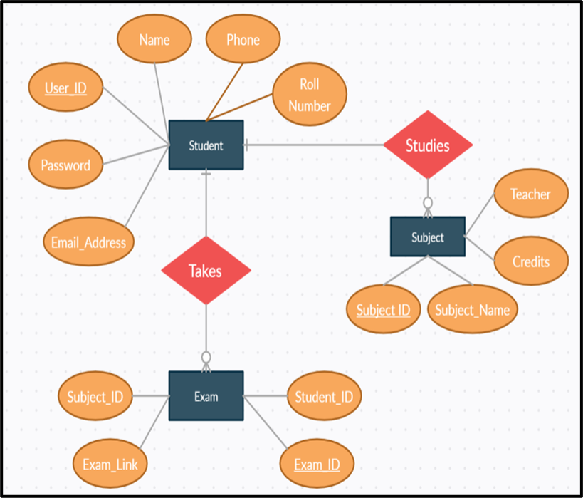
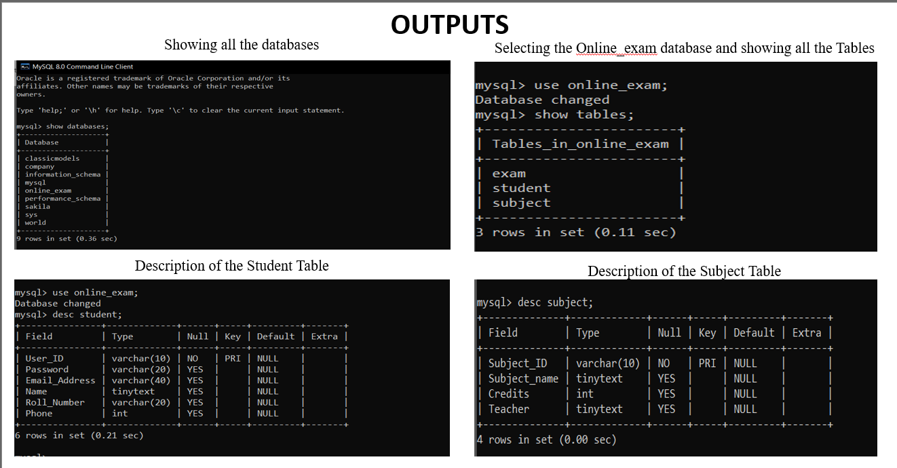
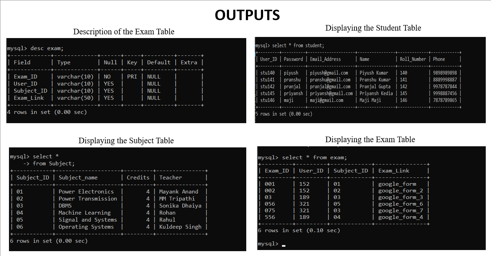

# Online-Exam-Management-System

Student's Online Exam Database Management System using Python and MySQL Python

In this project, I have designed a database that will keep record of students, their subjects and the online exam they give. This project is helpful for students to take examination online by giving them the examination link automatically. 

This project has been developed using MySQL software and Python Programming language. The required Database is `Online Exam` and has three Tables that are ‘Student’, ‘Subject’ and ‘Exam’. These are the three entities in this Database

In this project I have created multiple Python based modules and function binding MySQL to work on the required database. Using these python functions, we can:
1. Append new entries to all three tables
2. Delete the existing entries.
3. Update the entries
4. And select the entries based on the Primary Key.

To all the tables in the Database. We have created a menu-driven and User-friendly Python program to easily manage, add, alter and delete the data entries in the tables. On executing the Python file, it will automatically connect to the database on the Local Host server. As the execution of the program continues the program will provide the user with various options to manipulate and edit the various tables in the Database.

# ER Diagram

# MySQL Command Line

